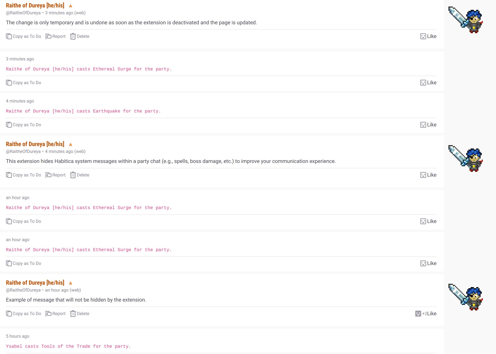
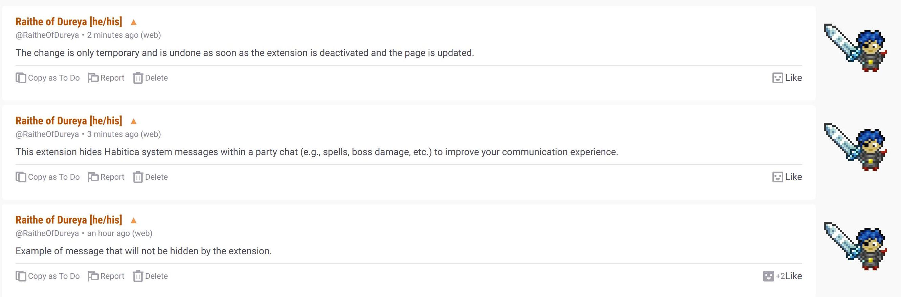
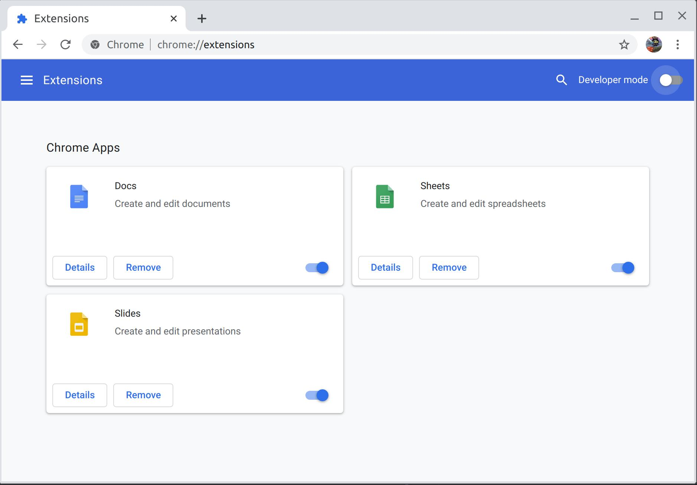
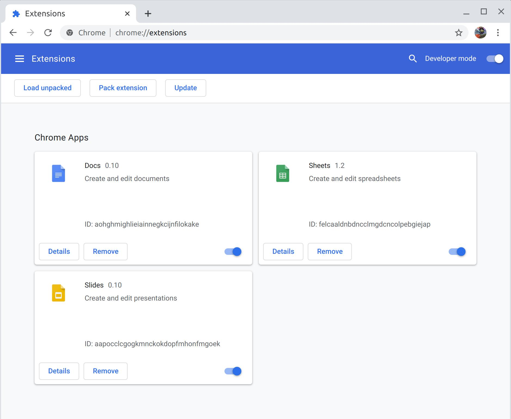
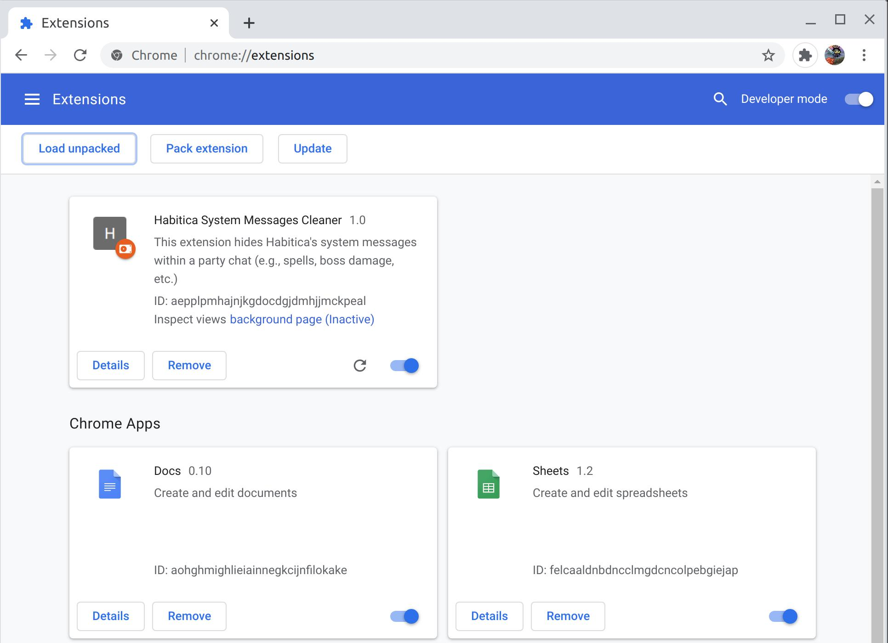
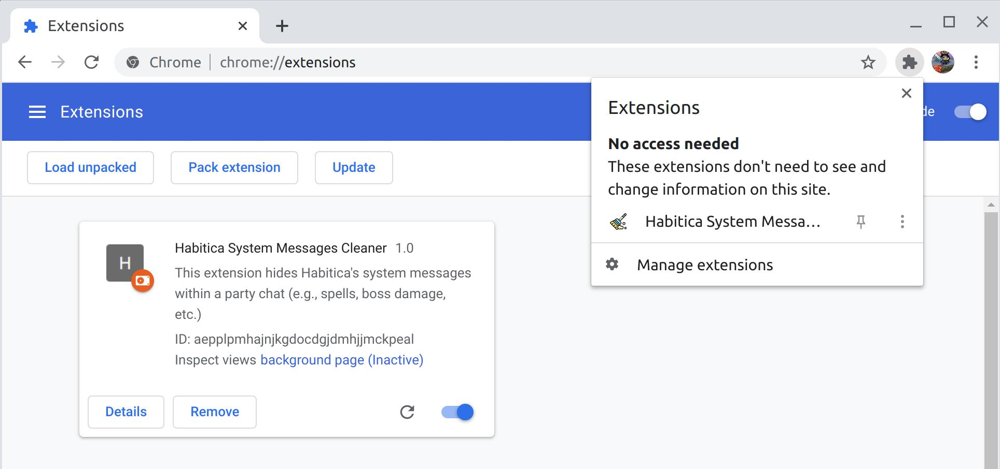
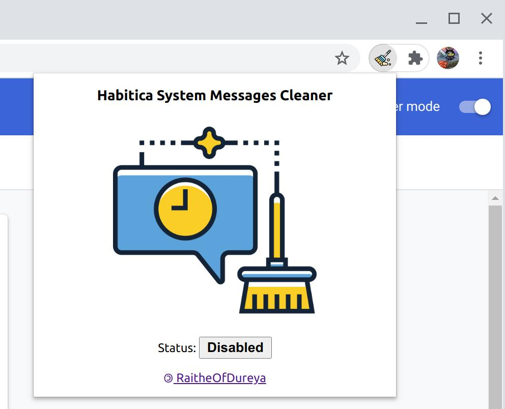

# Habitica System Messages Cleaner Extension

This extension hides Habitica system messages within a party chat (e.g., spells, boss damage, etc.) to improve your communication experience.

The change is only temporary and is undone as soon as the extension is deactivated and the page is updated.

*Example of party chat with the extension* **disabled:**

*Example of party chat with the extension* **enabled:**

## Compatibility
This extension is compatible with Google Chrome, Chromium, Firefox, Opera, and Brave Web Browsers.

## Content
It contains seven files: `manifest.json`, `background.js`, `content.js`, `popup.html`, `popup.js`, `icon.png`, and `logo.png`.

## Installing the extension in your browser

1. Clone or Download this repository.

2. Go the your [Chrome Extensions](chrome://extensions/) page. It will look similar to this:

3. **Turn on the Developer Mode** on the top right corner of the page. Once you enable it, you will see the `Load unpacked` button on the top left corner of the page.

4. Now, you just need to click on the `Load Unpack` option and find the directory that you downloaded this extension and select the `habitica-system-messages-cleaner-extension` folder. Once done you will see something similar to this:

5. Next, you could navigate to your extension manager and pin this extension so that is it becomes visible on extension bar (*optional*).

6. By default the extension is deactivated. Click on the icon of the extension to open the menu in order to enable/disable the extension.

*Congratulations! You did it! :tada::tada::tada: Now the Habitica System Messages Cleaner Extension is loaded in your browser and ready to help you!*

## Contributing

See our [Contributing Guidelines](CONTRIBUTING.md).

## Code of Conduct

See our [Code of Conduct](CODE_OF_CONDUCT.md).

## Credits

Icons made by <a href="https://www.flaticon.com/authors/flat-icons" title="Flat Icons">Flat Icons</a> from <a href="https://www.flaticon.com/" title="Flaticon">www.flaticon.com</a>

## LICENSE:
Copyright (c) 2020 RaitheOfDureya

Licensed under the MIT License.
